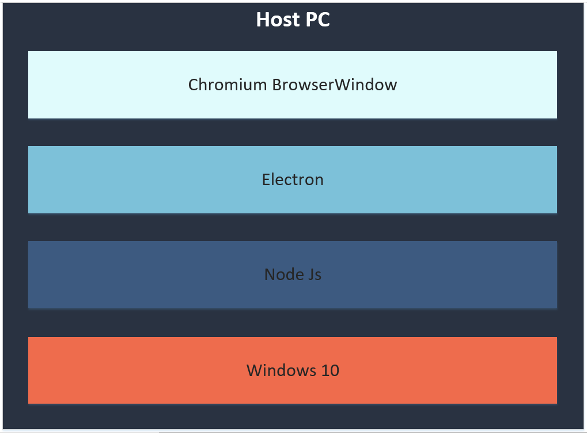

# Electron Port Scanner

Diese Electron Applikation dient zur überprüfung der Standardports auf einem beliebigen Server.

## Inhalt

- [Electron Port Scanner](#electron-port-scanner)
  - [Inhalt](#inhalt)
  - [Anleitung](#anleitung)
  - [Schema](#schema)
  - [Umsetzung](#umsetzung)
  - [Versionen](#versionen)

## Anleitung 
Um den Portscanner verwenden zu können clonenen sie als erstes dieses Repository.

`git clone https://github.com/WhyAreYouADog/EPS.git`

Danach wechseln sie in das `cd EPS/code` Verzeichnis.

Installieren sie dann alle nötigen module mit `npm i `.

Danach können sie das Programm mit `npm start` starten.

Im oberen Eingabefeld kann eine IP oder Domain angegeben werden. 
Mit dem Scan Button werden die wichtigsten Ports vom Ziel gescannt.

## Schema



Die ganze Applikation bassiert auf Node Js, darüber wurde dann mit der NPM Library [Electron](https://www.electronjs.org/) gearbetet. Diese ermöglicht es Node Js code als Desktop applikation laufen zu lassen. In diesem Fall wird ein Chromium BrowserWindow als Dektop Applikatio simuliert.

In dieser Umgebung wurde die Applikation entwickelt. Windows 10 ist nicht dringend notwendig es können auch alle anderen Betriebsystemem verwenden auf denen Node Js lauffähig ist.

## Umsetzung 

Wie bereits erwähnt wurde in diesem Projekt mit Electron gearbeitet, nebenbei wurde auch noch die [nnmap](https://www.npmjs.com/package/nnmap.js) Library verwended. Diese scann die Wichtigsten Port eines Servers und gibt zurück ob diese Offen oder Geschlossen sind.

Im code wird dazu zuerst ein neues Scanner Objekt erstellt.

```
const scanner = new Scanner({
    profile: 'Quick scan',
});
```

Mit danach kann man mit der startScan() Funktion den eingentlichen Scan starten, als Parameter wird hier der Ziel host übergeben.

`scanner.startScan("127.0.0.1")`

Das scanner Objekt verfügt auch über einen EventListener mit dem man die ausgaben des Scans abfangen und weiter verarbeiten kann.

```
scanner.on('scanComplete', (nmapOut) => {
    document.getElementById("loadingDiv").style.display = "none"
    var data = nmapOut.scanData.data.hosts[0].ports.portArray
    listPorts(data)
});
```

## Versionen

|Programm |Version |
|---------|--------|
|Node Js|v16.1.0|
|electron|13.1.0|
|nnmap.js|1.0.1|
